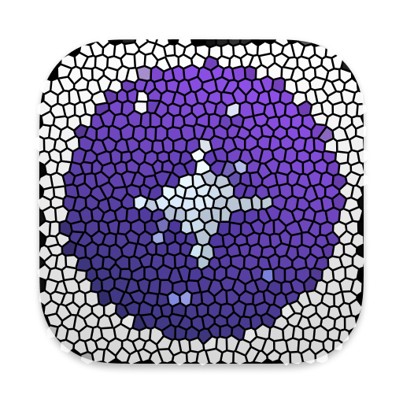

<p align="center">
  
</p>
<h1 align="center">orion</h1>

<p align="center">

</p>

<div align="center">
  <a href="#screenshots">Screenshots</a>
  <span>&nbsp;&nbsp;•&nbsp;&nbsp;</span>
  <a href="#specifications">Specifications</a>
  <span>&nbsp;&nbsp;•&nbsp;&nbsp;</span>
  <a href="#build">Build</a>
  <span>&nbsp;&nbsp;•&nbsp;&nbsp;</span>
  <a href="https://github.com/tylervick/orion/issues/new">Issues</a>
  <br />
</div>

# orion

## Screenshots


## Specifications

Create a simple macOS app called Orion using Swift and AppKit. The app UI will contain only a WebView, the address (URL) bar, a back button and the “+” for new tab functionality. Entering a URL in the address should open the URL in the webview.

- For this project you will download and compile WebKit and then use the compiled version to provide the WebView in your project.
- When this browser visits: https://addons.mozilla.org/en-US/firefox/addon/top-sites-button/
    - “Add to Firefox” button on the page should change to “Add to Orion”.
- The user should be able to directly install the extension from the web page by clicking the “Add to Orion” button (as if the user is visiting it from a Firefox browser). You can check how real Orion browser does it for reference (download Orion at https://browser.kagi.com)
- Your app will then handle downloading and ‘installing’ the extension by unpacking and processing the extension package. The installed extension will be visible in the browser as a button on the toolbar.
- Implement support for topSites javascript web extension API that this extension uses. Clicking the toolbar button will render the extension output as in Firefox (basically it will show the list of top sites you visited in a HTML rendered popup).
- Implement a custom WebKit navigation delegate method which will be fired every time when navigation changes (including manipulated navigation through History API). For example, addons.mozilla.org uses the history API to manipulate the current URL to navigate internal pages, which isn’t supported by the existing "decidePolicyFor navigationAction" delegate method.
- Use that custom navigation delegate method to make sure all navigated URLs are served for topSites API.


## Build

### Prerequisites

- Xcode 15.X (Tested on 15.2 (15C500b))
- Bun
    - `brew install bun`
    - Or see https://github.com/oven-sh/bun?tab=readme-ov-file#install

### Steps

#### 1. Clone the repository
- `git clone git@github.com:tylervick/orion.git`
#### 2. WebKit
##### 2.1 Clone the WebKit submodule
- `git submodule update --init --recursive`
##### 2.2 Build WebKit
```
cd WebKit
Tools/Scripts/build-webkit --release
cd ..
```

#### 3. Generate JS Bridge
```
cd OrionJSBridge
bun install
bun run build
cd ..
```

#### 4. Open/build the project
##### 4.1 Open the project
- `open Orion.xcodeproj`

##### 4.2 Build the project
- "Product" -> "Build" in Xcode
- Or `xcodebuild -scheme Orion -configuration Release`


### WIP Notes
- There's currently no UI for closing tabs, the window must be relaunched to close tabs
- To clear history/extensions, delete the db file
  - `rm -rf ~/Library/Containers/com.tylervick.orion/Data/Documents/orion.store`
- Uninstalling an extension works, but the button doesn't disappear until the app is relaunched

### Attributions

- Orion [Logo](https://kagi.com/orion/press-kit/icon-main-logo.png) by [Kagi](https://kagi.com/orion/press-kit/). Modifications were made to the original work for this project.
